# ExfilTracer
## Table of Contents

- [Summary](#summary)
- [Deploying the cloud server](#deploying-the-cloud-server)
  - [Prerequisites](#prerequisites)
  - [Setup](#setup)
  - [Deployment Procedure](#deployment-procedure)
  - [Parameters](#parameters)
- [Testing Exfiltration](#testing-exfiltration)
  - [Create Exfiltration Data](#create-exfiltration-data)
  - [Connect to the server](#connect-to-the-server)
  - [DNS Exfiltration](#dns-exfiltration)
  - [FTP Exfiltration](#ftp-exfiltration)
  - [HTTP Exfiltration](#http-exfiltration)
  - [ICMP Exfiltration](#icmp-exfiltration)

## Summary

ExfilTracer creates a cloud service to facilitate easy testing of data exfiltration methods during a penetration test. This project utilizes Ansible & Terraform to build a temporary disposable cloud server and DNS records in AWS. Where possible services will be secured using a password specified at run time along with IP address whitelisting on the AWS side if desired. Encryption has not been implemented and likely will not be. 

The created resources will be

- 1 x **EC2 instance** (Unless specified by parameter default size is t2.micro)
- 1 x **Security Group** (With ports opened to allow exfiltration service can be restricted to a single IP address with a parameter)
- 1 x **DNS A record** in the root domain specified pointing to the public IP address of the EC2 instance. This follows the pattern exfiltracer`client_ID`.`root_domain`. So in the given example with my domain `hulkgosmash.com` and the default value of `123` for the client_ID this will be `exfiltracer123.hulkgosmash.com`
- 1 x **DNS NS record** pointing to the previous A record following the pattern ns.exfiltracer`client_ID`. `root_domain`. So in this example that will be `ns.exfiltracer123.hulkgosmash.com`

------

**Don’t send sensitive data using this server, generate some random junk files and send those as a proof of concept.** 

------

## Deploying the cloud server

### Prerequisites

#### Packages

All testing was completed using a default installation of Kali version 2024.2.

- Ansible - `sudo apt install ansible`
- AWS CLI
- Terraform - `sudo apt install terraform`

#### Resources

- AWS Account
- AWS Hosted Domain Name
- SSH Private / Public key pair. Use `ssh-keygen` or something similar to create. Note if not using the default path this will have to be specified using the `public_key_path` & `private_key_path` parameters listed below.

### Setup

#### AWS CLI Installation

For more details or other operating systems see documentation. 

https://docs.aws.amazon.com/cli/v1/userguide/install-linux.html

```bash
curl "https://awscli.amazonaws.com/awscli-exe-linux-x86_64.zip" -o "awscliv2.zip"
unzip awscliv2.zip
sudo ./aws/install
```

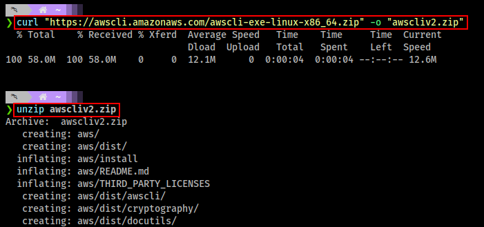

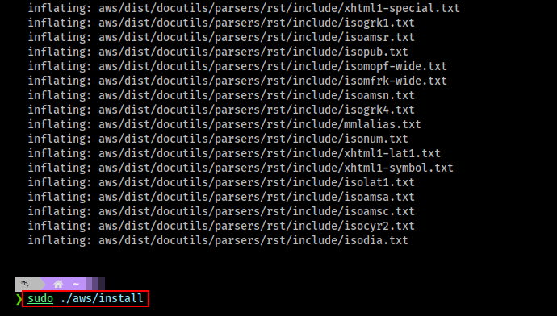

#### AWS CLI Configuration

Run configuration command and enter details of the your access key. 

```bash
aws configure
```

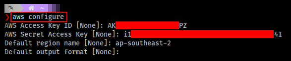

### Deployment Procedure

1. Clone the repository

```bash
git clone https://github.com/hulkgosmash/ExfilTracer.git
```

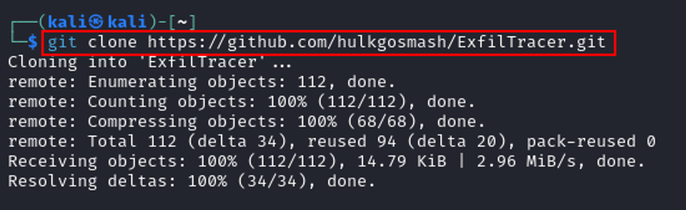

2. Change to the directory and initialize it with Terraform.

```bash
cd ExfilTracer
terraform init
```

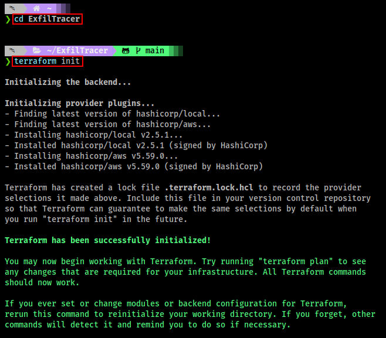

3. Deploy server using Terraform (Minimum parameters).

```bash
terraform apply -var="root_domain=hulkgosmash.com" -auto-approve
```

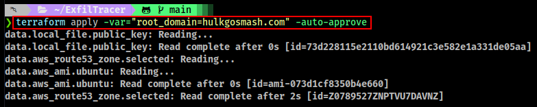

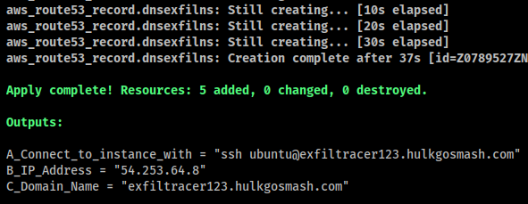

4. Deploy server using Terraform (Using all parameters). 

```bash
terraform apply -var="client_ID=test" -var="instance_type=t2.small" -var="ip_Address=1.1.1.1/32" -var="password=ZtHu@4LskWLner" -var="public_key_path=/home/kali/.ssh/id_rsa.pub" -var="private_key_path=/home/kali/.ssh/id_rsa" -var="region=us-east-1" -var="root_domain=hulkgosmash.com" -auto-approve
```

### Removal / Destroy Procedure

This will remove all resources (EC2 instance / DNS records)

```bash
terraform destroy -auto-approve
```

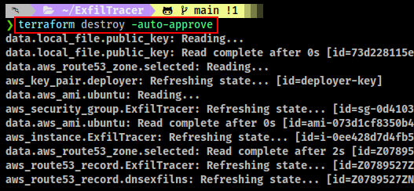

### Parameters

**client_ID**

- Name: `client_ID`
- Type: `String`
- Default: `123`
- Description: A unique value, to differentiate multiple deployments into the same AWS account.
- Mandatory: `No`

**instance_type**

- Name: `instance_type`
- Type: `String`
- Default: `t2.micro`
- Description: AWS Instance type, t2.micro seems to be sufficient. Larger sizes should be fine however smaller sizes may have problems if testing RDP. 
- Mandatory: `No`

**ip_Address**

- Name: `ip_Address`
- Type: `String`
- Default: `0.0.0.0/0`
- Description: IP Address to restrict traffic to. If not specified the ExfilTracer server will accept traffic from all IP addresses. To restrict traffic to a single IP Address set the value to something like `1.1.1.1/32` Where `1.1.1.1` would be the external IP Address of the server to be tested. **Note: ports 22 (SSH) & 53 (DNS) are not subject to the restrictions.** 
- Mandatory: `No`

**password**

- Name: `password`
- Type: `String`
- Default: `P@ssw0rd`
- Description: A password used to configure the accounts for the FTP, RDP & SMB services on the ExfilTracer server. It's best to set this to a secure value you have generated yourself. 
- Mandatory: `No`

**public_key_path**

- Name: `public_key_path`
- Type: `String`
- Default: `/home/kali/.ssh/id_rsa.pub`
- Description: The full path to the public SSH key file. If you don't have an SSH key you need to generate one. 
- Mandatory: `No`

**private_key_path**

- Name: `private_key_path`
- Type: `String`
- Default: `/home/kali/.ssh/id_rsa`
- Description: The full path to the private SSH key file. If you don't have an SSH key you need to generate one. 
- Mandatory: `No`

**region**

- Name: `region`
- Type: `String`
- Default: `ap-southeast-2`
- Description: The AWS region that the EC2 instance & Security group will be created in. 
- Mandatory: `No`

**root_domain**

- Name: `root_domain`
- Type: `String`
- Default: `hulkgosmash.com`
- Description: The AWS hosted root domain. You will definitely need to set and change this value. 
- Mandatory: `Yes`

## Testing Exfiltration
Testing will require the use of PowerShell for many protocols. All of the referenced scripts will be provided inline in this readme as well and being stored in the /scripts sub-directory. All testing examples shown below were performed on Windows 11 22H2 with all updates installed as of 26/07/2024. 

### Create Exfiltration Data

Copy and paste the below script into a PowerShell window to generate some random data to be exfiltrated. The script will also generate a hash so that we can verify the consistency of the data after it has been exfiltrated. In this example the file `exfil.txt` will be created in the root directory of the current user profile which is the directory PowerShell will likely load by default. 

```powershell
$base64String = ''
while ($base64String.Length -lt 1024) {
    $randomBytes = New-Object byte[] 512
    $rand = New-Object System.Random
    $rand.NextBytes($randomBytes)
    $base64String += [Convert]::ToBase64String($randomBytes)
}
# Trim the string to ensure it's exactly 1024 bytes
$base64String = $base64String.Substring(0, 1024)
# Set file path
$filePath = "$env:USERPROFILE\exfil.txt"
# Write base64 string to file
Set-Content -Path $filePath -Value $base64String -Encoding ASCII
# Get file hash
Get-FileHash -Path $filePath
```
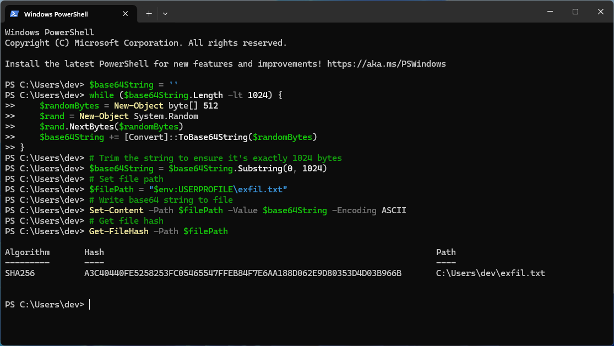

### Connect to the server

Using the output from the the terraform build command we can find the required command to connect to the server. Enter yes to continue connecting then elevate to the root account. 

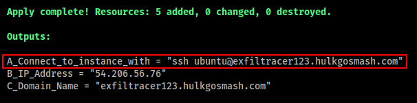

```bash
ssh ubuntu@exfiltracer123.hulkgosmash.com
yes
sudo su
```

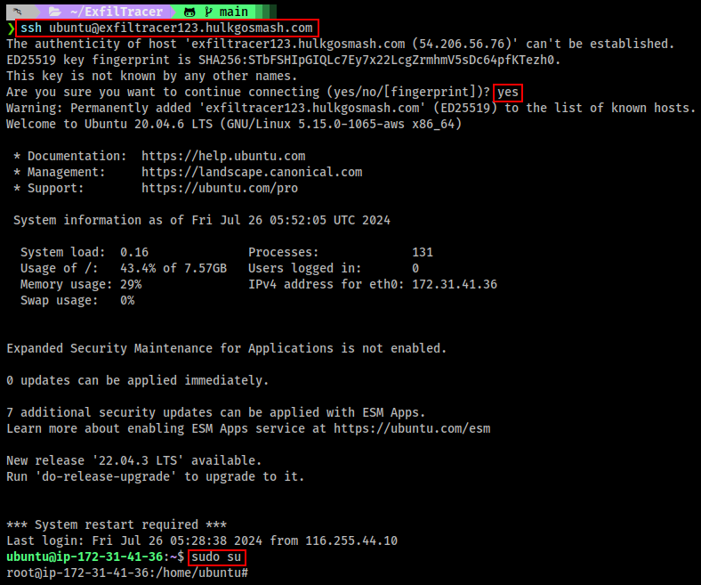

### DNS Exfiltration

On the server run the below command. 

```bash
tcpdump -n udp port 53 -i any | tee raw_output.txt
```

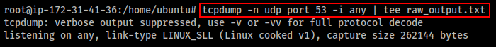

On the client to be tested open PowerShell ISE and copy the contents of the script `DNS_Exfiltration.ps1` located in the scripts folder of this repository. Take note of the `$domain` variable as this will need to be updated to match the value shown in the output of the terraform command. 

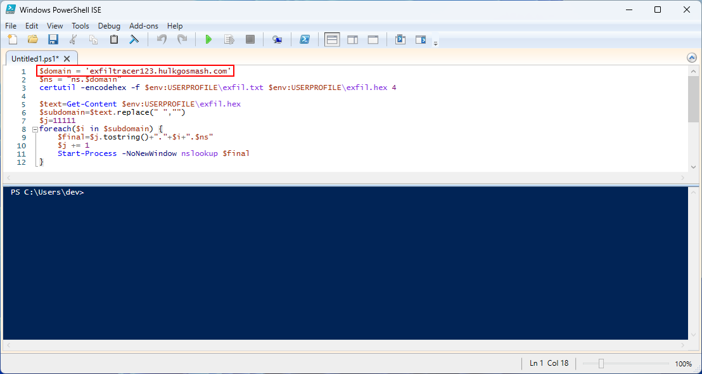

One you have updated the `$domain` variable click on the green play button to execute the script. 

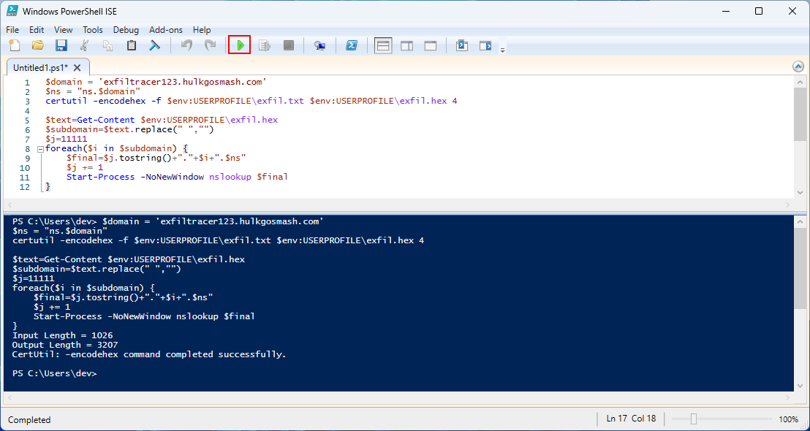

On the server you should see a bunch of DNS requests coming through wait a few minutes to ensure that it has stopped then hit `ctrl+c`. 

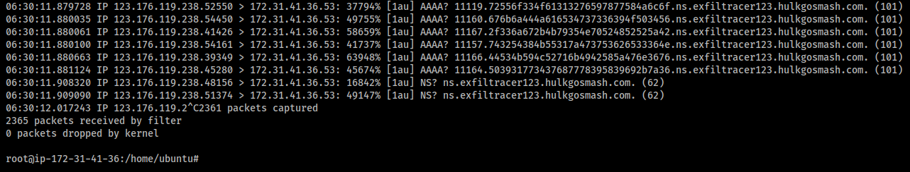

Run the below command on the server to recover the file. 

```bash
cat raw_output.txt | cut -d " " -f13 | cut -d "." -f1,2 | grep '^[0-9]' | tr '[:lower:]' '[:upper:]' | sort -u | cut -d "." -f2 | xxd -r -p > dns_exfil.txt
```

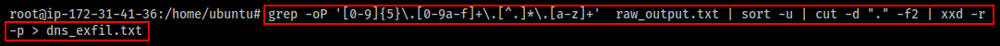

### FTP Exfiltration

Open File Explorer and in the address bar type in `ftp://` followed by the domain as shown in the output from terraform. 

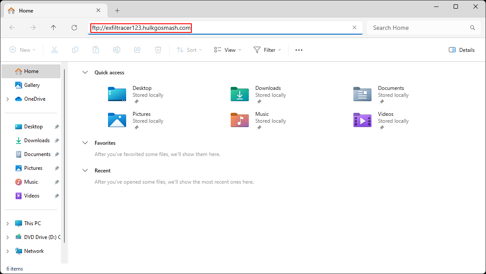

When prompted enter the username as `ftpuser` and if you specified a password as a terraform it will be this otherwise it will be the default value of `P@ssw0rd`. 

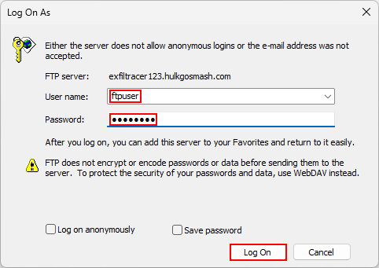

FTP to a public FTP site may be blocked by default on Windows. If you have Administrator access you can click Allow access on the prompt below. 

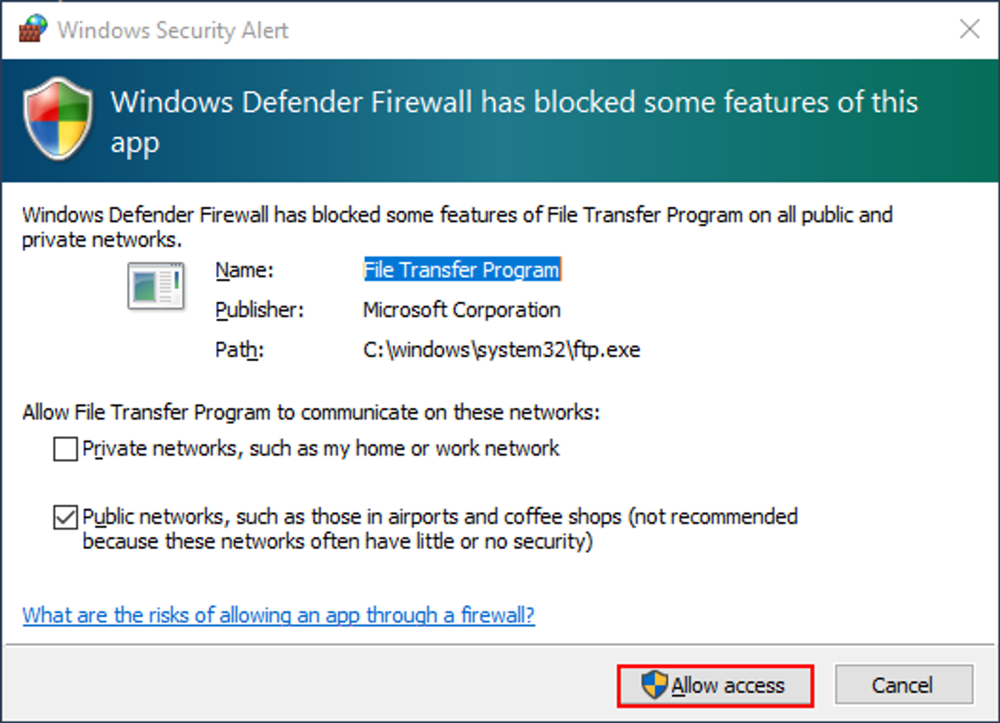

Click on the `+` icon in the open File Explorer window to open an additional tab. 

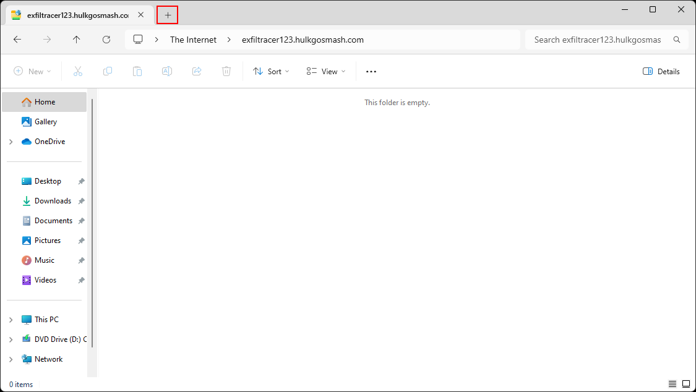

Navigate to the user profile directory then right click on the `exfil.txt` file and select the copy icon. 

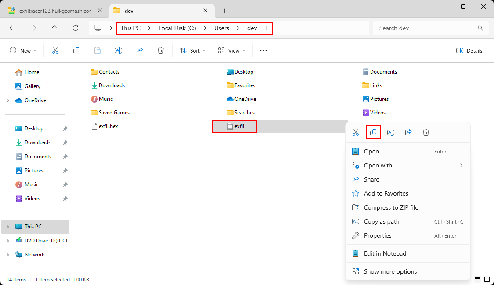

Left click on the FTP tab then right click and select the `paste` icon. 

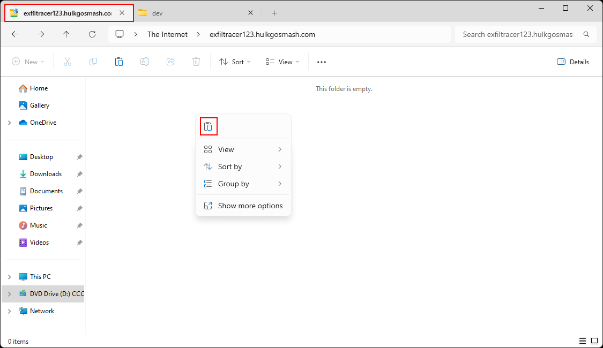

You should then see that the file has been uploaded to the FTP service of the AWS EC2 instance. 

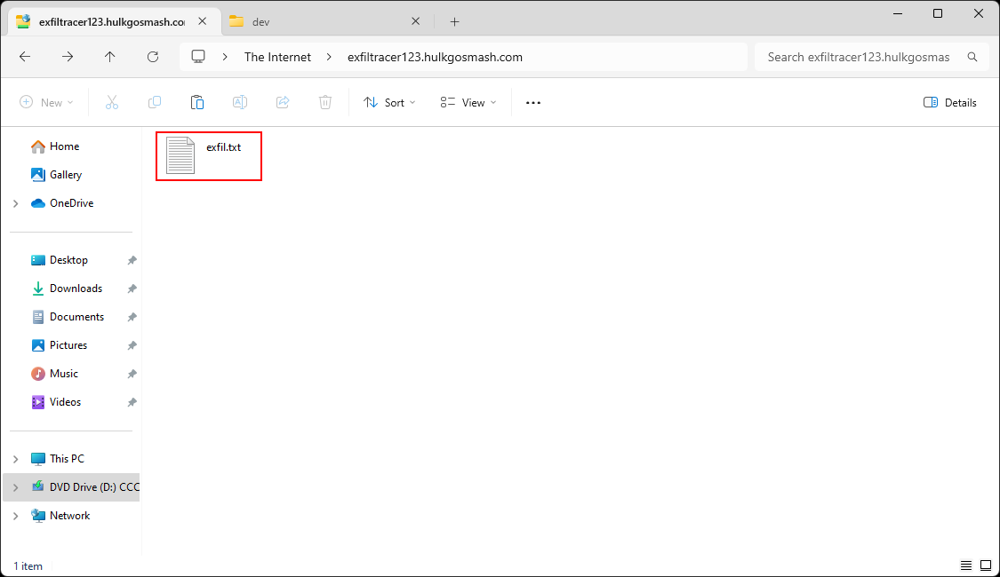

We can then use the below code to verify the file on the server. 

```bash
sha256sum /home/ftpuser/exfil.txt
```

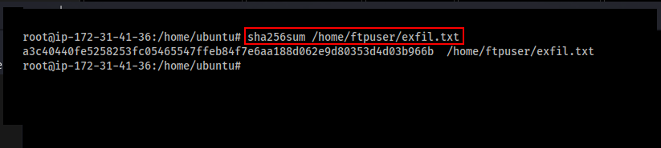

### HTTP Exfiltration
Open a web browser and navigate to the URL of the subdomain that was created during deployment. Click on the `Choose File` button.

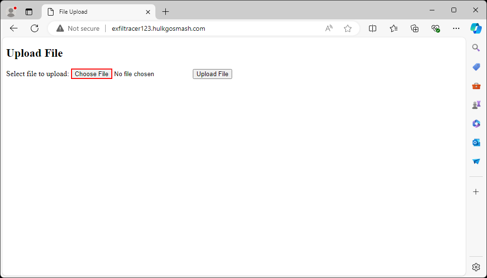

Select the `exfil.txt` file from the user profile directory and once the file has been selected click on the `Upload File` button. 

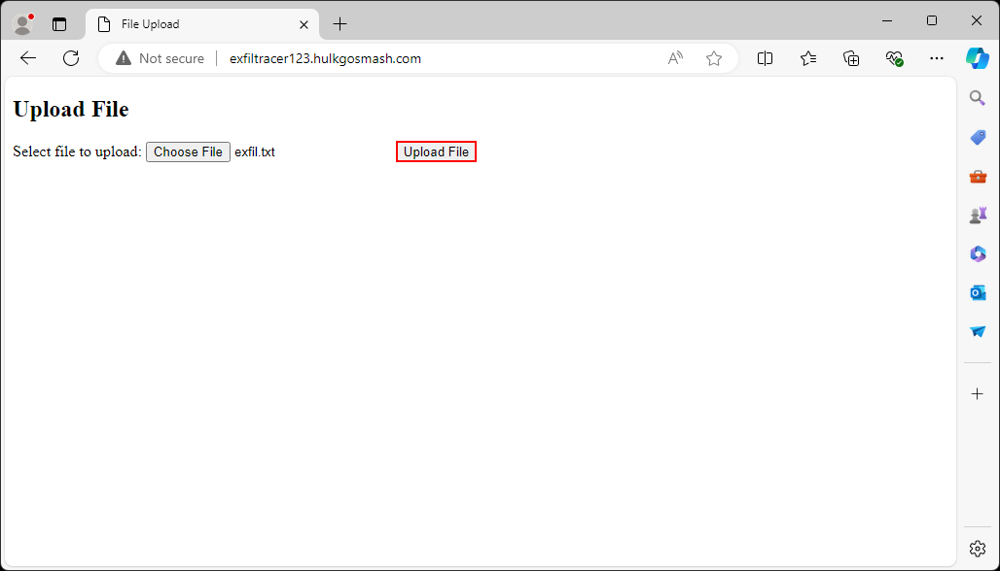

You should see confirmation that the file has been uploaded. 

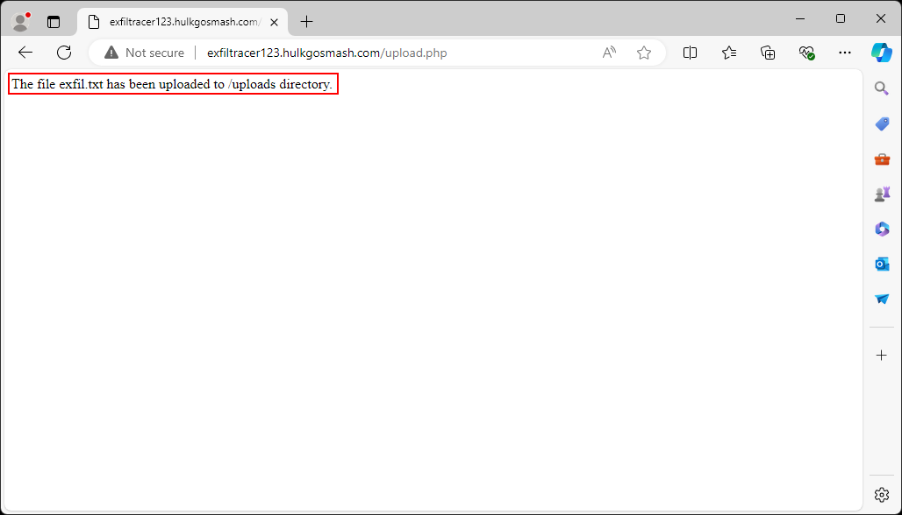

Back on the server locate the file in the `/var/www/html/uploads` directory it will have been renamed with a random value appended to the front. The verify the file has been uploaded using the `sha256sum` command. 

```bash
ls /var/www/html/uploads
sha256sum /var/www/html/uploads/66a37d9f055ab-exfil.txt
```

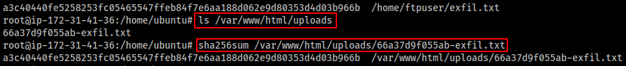

### ICMP Exfiltration

On the client in the open PowerShell ISE window type the below command to find out the external IP address is. 
```powershell
(curl ifconfig.me).Content
```

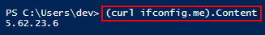

On the server run the below commands to get the server setup to receive the file. Be sure to substitute the IP address with the one gathered in the above command. 

```bash
cd /home/ubuntu/ICMP-TransferTools/
python3 ICMP-ReceiveFile.py 5.62.23.6 exfil.txt
```

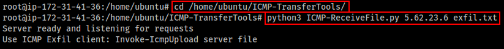

On the client import copy and paste the function listed here https://github.com/icyguider/ICMP-TransferTools/blob/main/Invoke-IcmpUpload.ps1 into PowerShell ISE. Then click on the green play button. 

